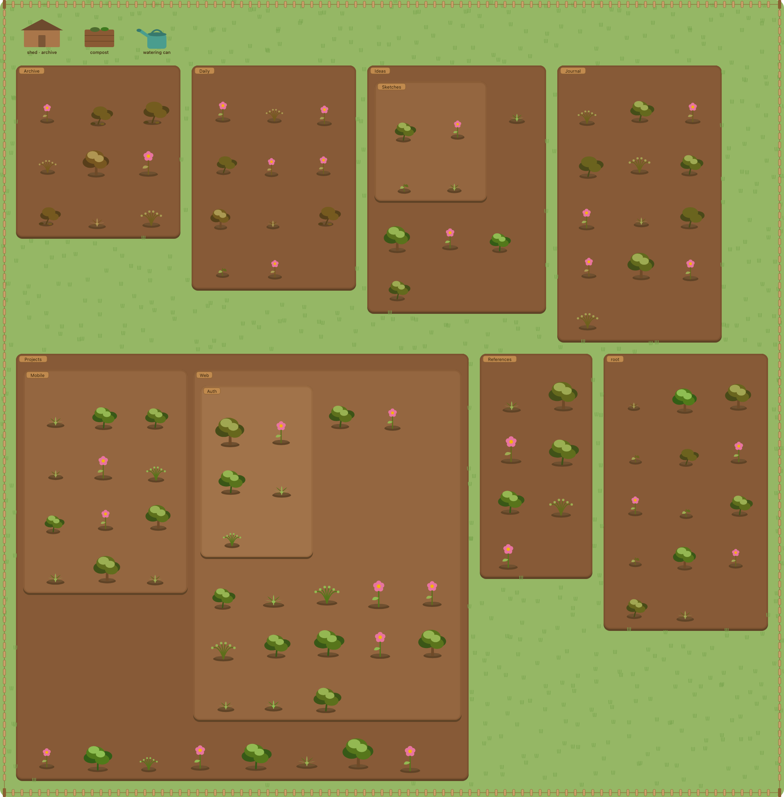
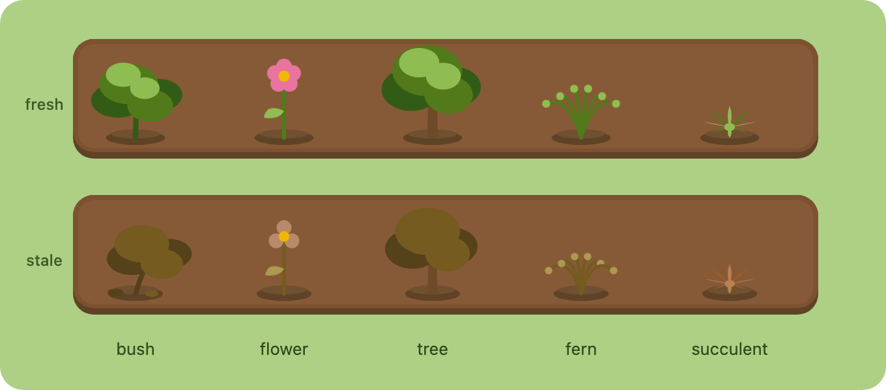
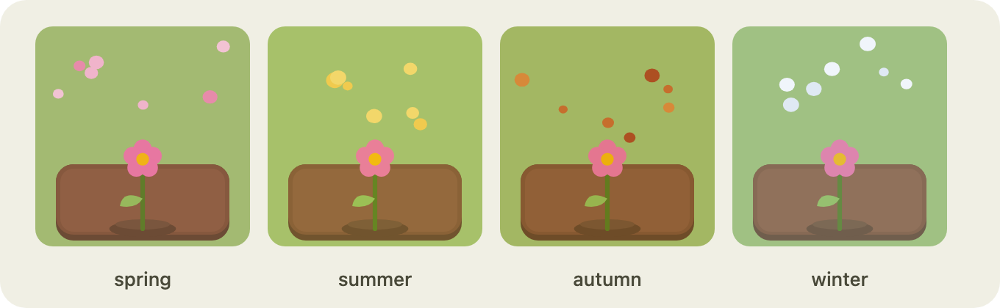
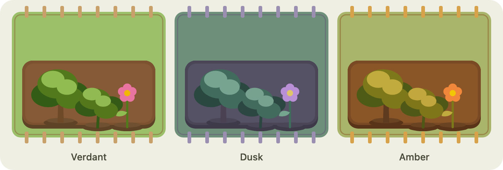

# 🌱 Vault Garden

> Your vault as a living garden. Every note is a plant whose health reflects how
> recently you've touched it and how well it's connected — so at a glance you can
> see what's thriving and what needs tending.



Graph View tells you *what links to what*. **Vault Garden tells you what needs
tending.** A flourishing, flowering plant is a note you edit often and link
well. A big, browning tree is an important note you've neglected. A wilted
sprout with moss creeping in is a stale orphan you can prune.

Nothing here is a separate game state you have to maintain — the garden is always
a *true* reflection of your vault's real metadata. Edit a note and it perks back
up; ignore one and it slowly, gently wilts (logarithmically — a note untouched
for a year gets weedy, it never "dies"). Everything is local; no backend, no
telemetry.

## Features

**The living garden** — a beautiful, at-a-glance read on vault health.
- Painterly, procedurally drawn plants in **five species** (bush, flower, tree,
  fern, succulent), each assigned per note.
- **Freshness** ramps a plant's palette green → brown and droops it;
  **connectivity** drives its size and stature. A big, brown, drooping plant =
  *important but neglected*.
- Notes clump by folder into **nested soil beds** (subfolders nest inside their
  parent), on a grassy world with a picket fence and folder signposts.
- **Hover** any plant for a card: title (click to open), a plain-English state,
  and stats (last edited, link count).
- **Ambient sway** and **seasonal weather** — drifting leaves, snow, petals or
  pollen, by the real date or your choice.
- **Pan and zoom** the garden (drag / scroll / buttons); it fills the pane
  instead of shrinking as your vault grows.

**Tend it** — gardening gestures that map to real vault operations.
- **Drag a plant to another bed** to move the note to that folder (subfolders
  included).
- **Shed** → archive the note. **Compost** → send it to trash (with a confirm).
- **Watering can** → refresh a note's freshness without opening it — drop a
  plant on the can, or pick the can up as a tool and click plants.
- **Arrange your garden**: free-place plants and drag whole beds by their
  signpost; your layout is saved. A reset button restores the auto-layout.

**Make it yours** — theme packs.
- Built-in themes: **Verdant**, **Dusk**, **Amber**. Switch live in settings.
- Drop your own **palette packs** (a JSON of colours) or **sprite packs**
  (bring-your-own plant/structure art) into the plugin's `themes/` folder. See
  [docs/THEME-PACKS.md](docs/THEME-PACKS.md).

## Gallery

Five plant species, each shown fresh and wilting — the same note greens and
stands upright when you edit it, then browns and droops as it goes stale:



Seasonal atmosphere — a subtle tint plus drifting particles (spring petals,
summer pollen, autumn leaves, winter snow), by the real date or your choice:



Theme packs re-skin the whole garden — the three built-in themes below, plus
palette or sprite packs you drop into the `themes/` folder:



## Install

**Manual install** (until it's on the community list):

1. Download `main.js`, `manifest.json`, and `styles.css` from the
   [latest release](https://github.com/Enoai/obsidian-garden-plugin/releases).
2. Copy them into `<your-vault>/.obsidian/plugins/vault-garden/`.
3. Enable **Vault Garden** in *Settings → Community plugins*.

Open the garden from the ribbon (the sprout icon) or the command palette
(`Vault Garden: Open garden`).

## Usage

| Gesture | What it does |
| --- | --- |
| Click a plant | Open the note |
| Hover a plant | Info card (title, state, last edited, links) |
| Drag a plant → another bed | Move the note to that folder |
| Drag a plant → shed | Archive the note |
| Drag a plant → compost | Delete to trash (confirm) |
| Drag a plant → watering can | Refresh the note's freshness |
| Click the watering can | Pick it up; click plants to water; Esc to drop |
| Drag a plant on the lawn / its bed | Place it there (remembered) |
| Drag a bed by its signpost | Move the whole plot |
| Drag empty ground / scroll | Pan / zoom |

Settings let you tune the scoring (freshness half-life, connectivity
saturation), the archive folder, the season, the theme, and update debounce.

## How health is computed

Two independent axes, each normalised to `0..1`:

- **Freshness** — `0.5 ^ (daysSinceModified / halfLifeDays)`. Drops fast then
  flattens; never reaches zero.
- **Connectivity** — `min(1, links / saturation)`. Saturating, so a hub isn't
  ten times an averagely-linked note.

Freshness drives vitality (colour, droop, wilt); connectivity drives stature
(size); together they pick a stage (seed → sprout → growing → flowering →
wilting). See [docs/ARCHITECTURE.md](docs/ARCHITECTURE.md#scoring-model).

## Development

```bash
npm install
npm run dev      # esbuild watch — rebuilds main.js on change
npm test         # unit tests (pure model + layout)
npm run build    # type-check + production bundle
```

Symlink the repo into a test vault to try it live:

```bash
ln -s "$(pwd)" /path/to/YourVault/.obsidian/plugins/vault-garden
```

The codebase is built to be forked — pure domain logic, a single Obsidian
adapter, and `Renderer` / `Layout` seams. Start with
[docs/ARCHITECTURE.md](docs/ARCHITECTURE.md), then
[docs/CONTRIBUTING.md](docs/CONTRIBUTING.md) for the dev loop and extension
recipes.

## Roadmap

Phases 1–3 are complete. On the backlog (unscheduled — contributions welcome):

- **Deeper visual customization** — a pack manager, themeable structures and
  backgrounds, and mapping plant species by tag/folder.
- **Custom weather** — tunable particles and density, and weather that responds
  to vault activity.
- **Performance at scale** — viewport culling and a Canvas renderer for very
  large vaults.

Full list in [docs/ROADMAP.md](docs/ROADMAP.md#beyond--ideas--upcoming).

## Documentation

- [Architecture](docs/ARCHITECTURE.md) — data flow, seams, scoring.
- [Roadmap](docs/ROADMAP.md) — what's built, phase by phase.
- [Contributing](docs/CONTRIBUTING.md) — dev setup + how to extend.
- [Theme packs](docs/THEME-PACKS.md) — palette and sprite pack formats.
- [Concept brief](obsidian-garden-plugin-README.md) — the original pitch.

## License

[MIT](LICENSE) © Declan Holmes-Carr
