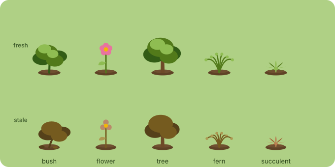
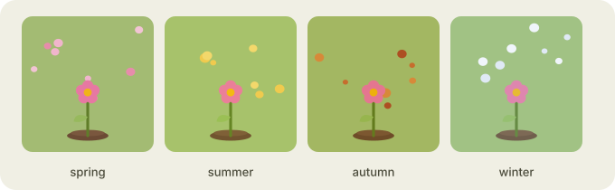
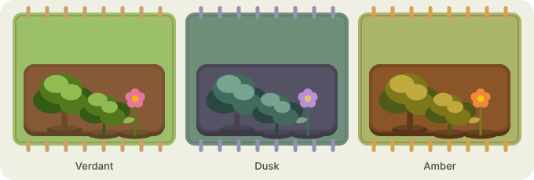

# Architecture

This document is the map. If you're forking or contributing, read it first —
it explains the module boundaries and *why* they're drawn where they are. The
whole design exists to make the [roadmap](ROADMAP.md)'s later phases additive
rather than rewrites.

## Design principles

1. **One-directional data flow.** Vault events flow in one direction to pixels.
   No component reaches backwards. This makes the system easy to reason about
   and easy to test.
2. **Isolate Obsidian.** Exactly one module touches Obsidian's data APIs
   (`VaultAdapter`). Everything else works on plain domain types. You can unit
   test the entire model and scoring layer with no Obsidian in sight, and a
   port to another app only rewrites one file.
3. **Pure domain logic.** Scoring is pure functions of numbers and dates —
   deterministic, trivially testable, no side effects.
4. **Program to interfaces at the seams.** `Renderer` and `Layout` are
   interfaces. The SVG renderer and grid layout are just the first
   implementations. This is what makes SVG↔Canvas↔sprites and
   grid↔persisted-placement swappable instead of surgical.

## The data flow

```
┌──────────────┐   debounced    ┌──────────────┐   pure    ┌──────────────┐
│   Obsidian   │  change events │ VaultAdapter │ snapshot  │  GardenModel │
│ Vault/Meta   │ ─────────────▶ │  (isolates   │ ────────▶ │ builds/updates│
│    Cache     │                │   Obsidian)  │           │  GardenState │
└──────────────┘                └──────────────┘           └──────┬───────┘
                                                                   │ GardenState
                                                                   ▼
┌──────────────┐   visuals     ┌──────────────┐  positions  ┌──────────────┐
│   The pane   │ ◀──────────── │   Renderer   │ ◀────────── │    Layout    │
│  (ItemView)  │   render()    │ (SVG today)  │  place()    │ (grid today) │
└──────────────┘               └──────────────┘             └──────────────┘
```

`GardenState` is the single source of truth the view renders from. `Layout`
decides *where* each plant goes; `Renderer` decides *what* it looks like. They
are deliberately separate so you can change placement without touching drawing,
and vice versa.

## Module map

```
src/
├── main.ts                  Plugin entry. Lifecycle + wiring only — no logic.
├── settings.ts              Settings tab, defaults, persistence.
│
├── model/                   Pure domain. No Obsidian imports allowed here.
│   ├── types.ts             Core types: NoteId, HealthScore, PlantState, GardenState…
│   ├── health.ts            Pure scoring: freshness(), connectivity(), stageOf().
│   └── GardenModel.ts       Builds GardenState from a VaultSnapshot; incremental update.
│
├── data/                    The ONLY place Obsidian data APIs are touched.
│   ├── VaultAdapter.ts      Reads timestamps + links → plain VaultSnapshot.
│   └── events.ts            Debounced subscription to vault/metadata changes.
│
├── layout/                  Where plants go.
│   ├── Layout.ts            interface Layout { place(state): PositionedGarden }
│   └── GridLayout.ts        Phase 1 default. (PersistedLayout arrives in Phase 2.)
│
├── render/                  What plants look like.
│   ├── Renderer.ts          interface Renderer { mount, render, on, destroy }
│   └── svg/
│       ├── SvgRenderer.ts   Phase 1 default renderer.
│       ├── plants.ts        Procedural plant-drawing functions (pure: state → SVG).
│       └── world.ts         Ground, border, ambient effects.
│                            (render/sprite/ arrives in Phase 3.)
│
├── view/
│   └── GardenView.ts        The ItemView. Owns the host element; drives the loop.
│
└── util/
    ├── debounce.ts
    └── math.ts              clamp, lerp, decay helpers.
```

**Dependency rule:** arrows point *inward* to `model/`. `model/` depends on
nothing project-specific and never imports from `data/`, `render/`, `view/`, or
`obsidian`. `data/` may import `obsidian` and `model/types`. `render/` and
`layout/` depend only on `model/`. `view/` and `main.ts` wire everything
together. If you find yourself importing `obsidian` outside `data/` (or
`main.ts`/`view/` for lifecycle), stop — that's the smell this layout prevents.

## Core types

The vocabulary the whole app shares. See `src/model/types.ts` for the source of
truth; this is the shape:

```ts
/** A note's identity — its vault-relative path. */
export type NoteId = string;

/** Coarse visual bucket, derived from the score. Continuous score still
 *  drives fine detail (colour, droop); stage is for renderers that need
 *  discrete states (e.g. sprite packs). */
export type Stage = 'seed' | 'sprout' | 'growing' | 'flowering' | 'wilting';

/** What kind of plant — derived from tags/folders via user rules. */
export type PlantType = string; // e.g. 'flower' | 'tree' | 'shrub'

/** The two independent axes, each normalised 0..1. */
export interface HealthScore {
  freshness: number;    // 1 = just edited, → 0 as it ages (never reaches 0)
  connectivity: number; // 1 = well-connected hub, 0 = orphan
}

/** Everything the renderer needs to draw one plant. */
export interface PlantState {
  id: NoteId;
  title: string;
  type: PlantType;
  health: HealthScore;
  stage: Stage;
}

/** The single source of truth the view renders from. */
export interface GardenState {
  plants: Map<NoteId, PlantState>;
  generatedAt: number;
}
```

Layout adds positions on top without mutating `GardenState`:

```ts
export interface Position { x: number; y: number }
export interface PositionedGarden {
  plants: Map<NoteId, PlantState & { position: Position }>;
}
```

## The seams

### `VaultAdapter` — the Obsidian boundary

Everything Obsidian-specific lives here. It reads the app's `Vault` and
`MetadataCache` and produces a plain `VaultSnapshot` (paths, timestamps, link
counts) — no Obsidian objects escape. Benefits:

- The model and scoring layers are testable with hand-built snapshots.
- Swapping Obsidian internals (or porting elsewhere) touches one file.

```ts
export interface NoteMeta {
  id: NoteId;
  title: string;
  modifiedMs: number;
  createdMs: number;
  outLinks: number;
  backLinks: number;
}
export interface VaultSnapshot { notes: NoteMeta[]; takenAt: number }

export interface VaultAdapter {
  snapshot(): VaultSnapshot;
  /** Fires (debounced) when relevant vault/metadata changes. */
  onChange(handler: () => void): () => void; // returns an unsubscribe fn
}
```

### `Renderer` — the drawing seam

Turns garden state + positions into visuals in a host element. The procedural
SVG renderer is the first implementation; a Canvas renderer (for very large
vaults) or a sprite renderer (Phase 3 theme packs) are drop-in alternatives.

```ts
export type PlantEvent = { type: 'select'; id: NoteId };

export interface Renderer {
  mount(host: HTMLElement): void;
  render(garden: PositionedGarden): void;
  on(handler: (e: PlantEvent) => void): void;
  destroy(): void;
}
```

Note the renderer emits *semantic* events (`select`), not DOM events. The view
decides what "select" means (Phase 1: open the note). This keeps interaction
policy out of the drawing layer — which is what lets Phase 2 add drag semantics
without the renderer knowing about folders or archiving.

### `Layout` — the placement seam

```ts
export interface Layout {
  place(garden: GardenState): PositionedGarden;
}
```

`GridLayout` (Phase 1) is deterministic and stateless. `PersistedLayout`
(Phase 2) reads saved positions and falls back to grid for new notes. Because
placement is behind this interface, going from auto-grid to
drag-and-save-positions never touches the model or the renderer.

## Scoring model

Two independent axes, each normalised to `0..1`. Kept as separate axes (not one
blended number) because they mean different things and the *visual* encodes
them on different channels (vitality vs. stature).

**Freshness — half-life decay.** Recent edits matter a lot; the difference
between "1 year" and "2 years" stale shouldn't. Half-life decay gives a curve
that drops fast then flattens, and never actually reaches zero (a note gets
weedy, it never dies):

```
freshness = 0.5 ^ (daysSinceModified / halfLifeDays)
```

`halfLifeDays` (days for freshness to halve) is user-tunable; default ~30 days.

**Connectivity — saturating.** A note with 40 links isn't 10× a note with 4;
past a point, more links don't mean "more alive." A saturating curve captures
that:

```
connectivity = min(1, (outLinks + backLinks) / k)
```

`k` (the saturation point) is user-tunable; default ~8.

**Stage** is a coarse bucket derived from the two axes for renderers that need
discrete states (sprite packs). The continuous scores still drive fine detail
(exact colour, droop angle, bloom). See `stageOf()` in `health.ts`.

All three are **pure functions** — same inputs, same output, no side effects,
no Obsidian. They're the easiest thing in the codebase to test, and the
[tests](CONTRIBUTING.md#testing) prove the curves behave.

## Visual reference

The five plant species, each shown healthy (top) and neglected (bottom) — the
same note grows greener/upright when fresh and browns/droops as it goes stale:



Seasonal atmosphere — a subtle tint plus drifting particles, by the real date
or a setting: spring petals, summer pollen, autumn leaves, winter snow:



Theme packs re-skin everything — the three built-in themes below, plus palette
or sprite packs you drop into the `themes/` folder ([THEME-PACKS.md](THEME-PACKS.md)):



## Performance strategy

- **Debounce** vault/metadata events — they fire rapidly while typing. Recompute
  on the trailing edge (default ~250ms).
- **Incremental updates.** Editing a note changes its own freshness and its
  neighbours' connectivity. Phase 1 may recompute the whole `GardenState` (fine
  to low-thousands of notes); the model exposes an incremental path for when it
  matters.
- **Renderer patches, doesn't rebuild.** `render()` diffs against the previous
  `PositionedGarden` and updates only changed plants.
- **Viewport culling / Canvas** is only needed for very large (10k+) vaults —
  and the `Renderer` seam is exactly where that swap happens, no model changes.

## Testing strategy

The architecture is shaped so the valuable logic is testable without Obsidian:

- `model/health.ts` and `model/GardenModel.ts` — pure, unit-tested against
  hand-built `VaultSnapshot`s. This is where correctness lives.
- `layout/*` — deterministic, unit-tested (given N plants, expect a stable grid).
- `data/VaultAdapter.ts` — the thin, Obsidian-coupled part. Kept small on
  purpose; verified manually in a test vault.

See [CONTRIBUTING › Testing](CONTRIBUTING.md#testing).
